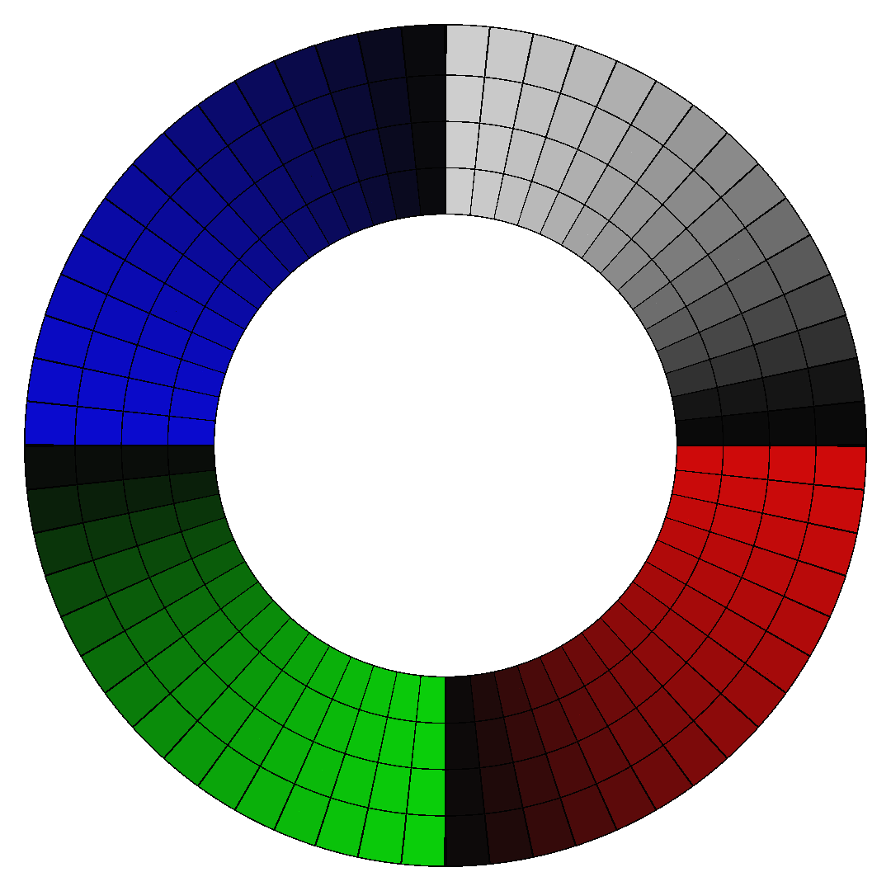
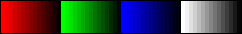
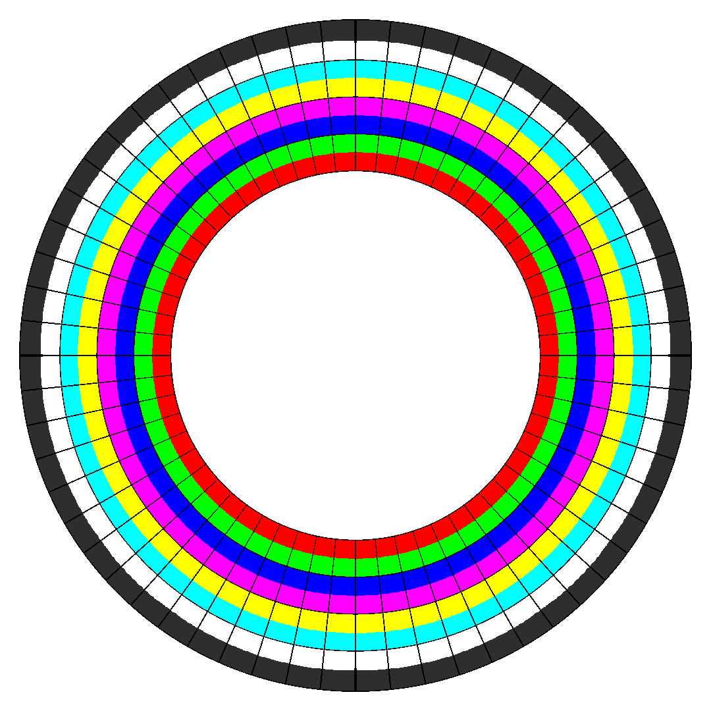
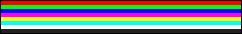

# Modifying LED Animations

LED Animations are saved as `.png` files.  
No additional animations can be added, but existing ones can be modified if you wish to do so.

## Texture Format

A standard console has a 60x8 LED matrix. 60 LEDs around, 8 LEDs from screen to edge. 
Each frame of a standard LED texture is therefore 60px wide, and 8px tall.

Non-standard LED textures can have different sizes, even ones that exceed the 60x8 bounds.  
*(The `vfx_ripple` texture is 9x14, for example!)*

Frames are separated by a 1px tall stripe of clear pixels. 
The alpha value of these pixels **must** be exactly 0.

## Frame Mapping

Frames are mapped top to bottom, with a 1px tall clear stripe across the entire width separating frames.

## LED Mapping

LEDs are mapped horizontally like this:

- Left edge on texture = 3 o' Clock on LED matrix. 
- 1px = 1 "square" area left/right.
- Proceed clockwise.

LEDs are mapped vertically like this:

- Top edge on texture = Inner edge (near screen) on LED matrix.
- Bottom edge on texture = Outer edge (near player) on LED matrix.
- 1px = 1/2 "square" area left/right.
  - There are 2 leds (vertically) per area.

## HALL OF NERDS:

If you want your name to be written in the HALL OF NERDS, convert Bad Apple to a valid LED animation *by yourself!*  
[E-Mail me](mailto:contact@yasu3d.art) your results with a link to the code used to convert the video, and a link to a video of it playing.  
The first 10 names will be written down here.

