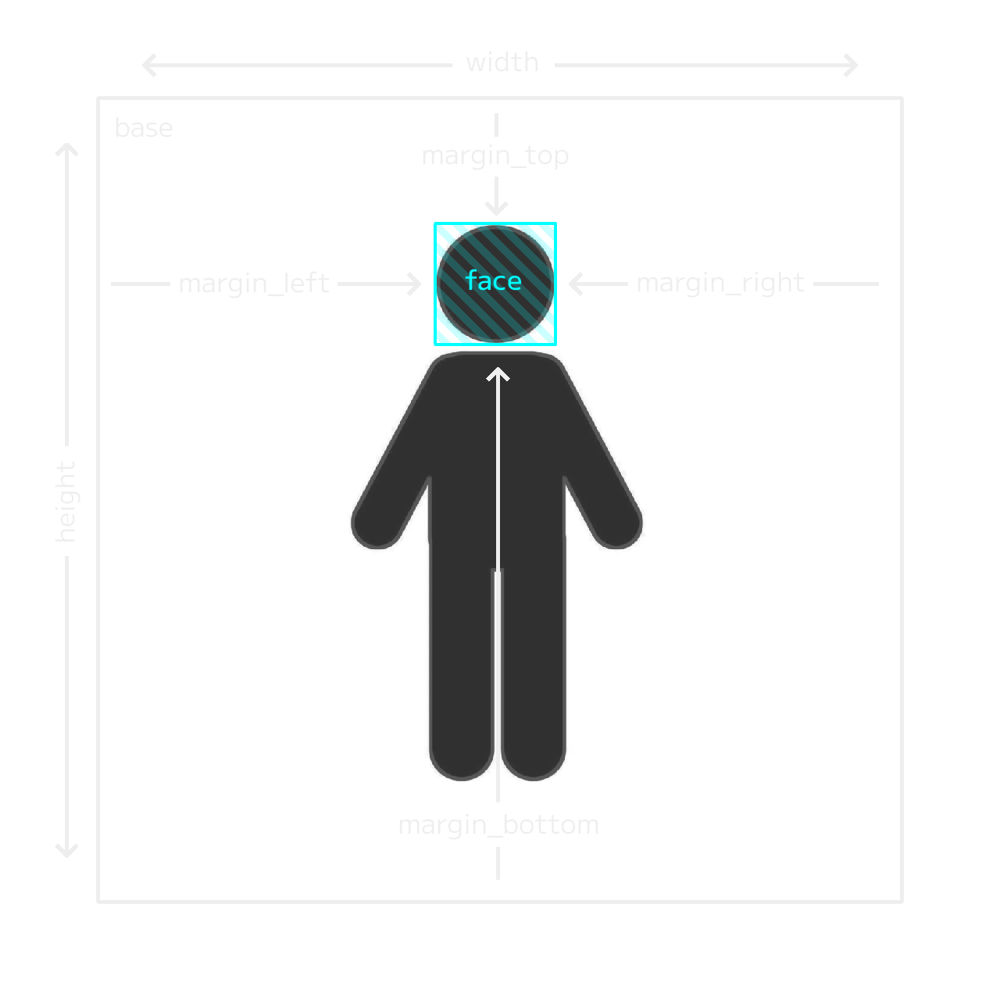

# Adding Navigators

## Supported Image Formats
- `.png` (recommended)
- `.jpg`/`.jpeg`

Navigators likely need transparency, so `.jpg`/`.jpeg` is *possible* to use, but not recommended.

## Supported Audio Formats
- `.wav` (recommended)
- `.mp3`
- `.ogg`

## File Structure

Any `.toml` file in `./Data/Navigator/` will be recognized as a `navigator`.  
All filepaths defined in `*.toml` are relative filepaths from the file.

```toml
# ...
[texture_paths]
image_icon = "image/icon.png"
image_base = "image/base.png"
# ...
[dialgues.en-US]
    [[dialogues.en-US.rhythmgame_result_clear_0]]
        message = "Clear"
        audio_path = "audio/rhythmgame_result_clear_0.wav"
# ...
```

```file tree
.
└── StreamingAssets/
    └── Data/
        └── Navigator/
            └── <NAVIGATOR>/
                └── navigator.toml/
                    ├── audio/
                    │   ├── rhythmgame_result_clear_0.wav
                    │   └── ...
                    ├── image/
                    │   ├── base.png
                    │   ├── icon.png
                    │   └── ...
                    └── navigator.toml
```

## Properties

| Property         | Value Type | Use Case                                                                   |
|------------------|------------|----------------------------------------------------------------------------|
| `guid`           | String     | A **G**lobally **U**nique **Id**entifier (GUID) to identify each cosmetic. |
| `name`           | String     | Name of the navigator.                                                     |
| `description`    | String     | Description of the navigator.                                              |
| `artist`         | String     | Artist that made the navigator.                                            |
| `voice`          | String     | Voice actor that recorded the audio.                                       |
| `width`          | Pixels     | Width of the base image to show in-game.                                   |
| `height`         | Pixels     | Height of the base image to show in-game.                                  |
| `offset_x`       | Pixels     | Horizontal offset of the base image.                                       |
| `offset_y`       | Pixels     | Vertical offset of the base image.                                         |
| `margin_top`     | Pixels     | Top margin from base image for face image.                                 |
| `margin_bottom`  | Pixels     | Bottom margin from base image for face image.                              |
| `margin_left`    | Pixels     | Left margin from base image for face image.                                |
| `margin_right`   | Pixels     | Right margin from base image for face image.                               |
| `blink_interval` | Seconds    | Time between blinks.                                                       |
| `blink_duration` | Seconds    | Time between frames of the blink animation.                                |
| `[textures]`     | Dictionary | Declares a collection of textures.                                         |
| `[dialogues]`    | Dictionary | Declares a collection of dialogues.                                        |

## Layout Properties

The layout properties allow Navigators to have the correct size and position without having to modify the textures. 
Width and Height define the size of the Navigator in-game. These values do not have to match the resolution of your texture.

- Positive offset will move the navigator to the right/up.
- Negative offset will move the navigator to the left/down.

Expressions are overlaid on top of the body image. To save resources, the expression textures can be cropped to only the face and aligned to fit over the body image with the margin properties.  
- Positive margins will shrink the face image inward.
- Negative margins will expand the face image beyond the body image bounds.



## Texture Properties

| Property            | Value Type | Affected Image        | Expression | Blink State      |
|:--------------------|------------|-----------------------|------------|------------------|
| `image_icon`        | Filepath   | Icon in Windmill Menu | /          | /                |  
| `image_base`        | Filepath   | Body only             | /          | /                |  
| `image_neutral_0`   | Filepath   | Face only             | Neutral    | Eyes fully open. |  
| `image_neutral_1`   | Filepath   | Face only             | Neutral    | Eyes half open.  |  
| `image_neutral_2`   | Filepath   | Face only             | Neutral    | Eyes closed.     |  
| `image_amazed_0`    | Filepath   | Face only             | Amazed     | Eyes fully open. |  
| `image_amazed_1`    | Filepath   | Face only             | Amazed     | Eyes half open.  |  
| `image_amazed_2`    | Filepath   | Face only             | Amazed     | Eyes closed.     |  
| `image_troubled_0`  | Filepath   | Face only             | Troubled   | Eyes fully open. |  
| `image_troubled_1`  | Filepath   | Face only             | Troubled   | Eyes half open.  |  
| `image_troubled_2`  | Filepath   | Face only             | Troubled   | Eyes closed.     |  
| `image_surprised_0` | Filepath   | Face only             | Surprised  | Eyes fully open. |  
| `image_surprised_1` | Filepath   | Face only             | Surprised  | Eyes half open.  |  
| `image_surprised_2` | Filepath   | Face only             | Surprised  | Eyes closed.     |  
| `image_startled_0`  | Filepath   | Face only             | Startled   | Eyes fully open. |  
| `image_startled_1`  | Filepath   | Face only             | Startled   | Eyes half open.  |  
| `image_startled_2`  | Filepath   | Face only             | Startled   | Eyes closed.     |  
| `image_angry_0`     | Filepath   | Face only             | Angry      | Eyes fully open. |  
| `image_angry_1`     | Filepath   | Face only             | Angry      | Eyes half open.  |  
| `image_angry_2`     | Filepath   | Face only             | Angry      | Eyes closed.     |  
| `image_laughing_0`  | Filepath   | Face only             | Laughing   | Eyes fully open. |  
| `image_laughing_1`  | Filepath   | Face only             | Laughing   | Eyes half open.  |  
| `image_laughing_2`  | Filepath   | Face only             | Laughing   | Eyes closed.     |  
| `image_smiling_0`   | Filepath   | Face only             | Smiling    | Eyes fully open. |  
| `image_smiling_1`   | Filepath   | Face only             | Smiling    | Eyes half open.  |  
| `image_smiling_2`   | Filepath   | Face only             | Smiling    | Eyes closed.     |  
| `image_grinning_0`  | Filepath   | Face only             | Grinning   | Eyes fully open. |  
| `image_grinning_1`  | Filepath   | Face only             | Grinning   | Eyes half open.  |  
| `image_grinning_2`  | Filepath   | Face only             | Grinning   | Eyes closed.     |
| `image_see_you_0`   | Filepath   | "See You" Screen      | /          | /                |
| `image_see_you_1`   | Filepath   | "See You" Screen      | /          | /                |
| `image_see_you_2`   | Filepath   | "See You" Screen      | /          | /                |

### Defining Properties

Textures are defined in the `[texture_paths]` dictionary. Each property can only be defined once, but different properties can share the same filepath.

```toml
# ...
[texture_paths]
image_base = "image/base.png"
image_neutral_0 = "image/neutral.png"
image_neutral_0 = "image/happy.png" # INVALID
```

```toml
# ...
[texture_paths]
image_base = "image/base.png"
image_neutral_0 = "image/neutral.png"
image_neutral_1 = "image/neutral.png" # VALID
```

### Omitting Properties

If your navigator doesn't have any expressions, you do not have to define blank expression filepaths. Instead, just omit all expression properties.

```toml
[texture_paths]
image_base = "image/base.png"
image_neutral_0 = ""
image_neutral_1 = ""
image_neutral_2 = ""
image_amazed_0 = ""
#...

# DONT DO THIS
```

```toml
[texture_paths]
image_base = "image/base.png"

# DO THIS
```

### Invalid Filepaths

If a filepath is invalid or undefined, then the image will be invisible in SATURN.  
If your navigator doesn't have artwork for a certain expression, don't keep the filepath undefined. Use a different expression's texture as a substitute.

```toml
[texture_paths]
image_base = "image/base.png"
image_neutral_0 = "image/neutral_0.png"
image_neutral_1 = "image/neutral_1.png"
image_neutral_2 = "image/neutral_2.png"
image_amazed_0 = ""
image_amazed_1 = ""
image_amazed_2 = ""
#...

# DONT DO THIS
```

```toml
[texture_paths]
image_base = "image/base.png"
image_neutral_0 = "image/neutral_0.png"
image_neutral_1 = "image/neutral_1.png"
image_neutral_2 = "image/neutral_2.png"
image_amazed_0 = "image/neutral_0.png"
image_amazed_1 = "image/neutral_1.png"
image_amazed_2 = "image/neutral_2.png"
#...

# DO THIS
```

## Dialogue Properties

Dialogues represent textbox data. They allow giving Navigators custom dialogue and assigning voice lines to specific textboxes.
Dialogues can also be localized, including different voice lines for each locale.

<table>
	<tbody>
		<tr>
			<th colspan="2">Dialogue Keys</th>
		</tr>
		<tr>
			<td><code>attract_login_greet</code></td>
			<td><code>attract_login_profile</code></td>
		</tr>
        <tr>
			<td><code>attract_login_name</code></td>
			<td><code>attract_welcome_unknown</code></td>
		</tr>
        <tr>
			<td><code>attract_welcome_returning</code></td>
			<td><code>mode_greet</code></td>
		</tr>
        <tr>
			<td><code>mode_select_singleplayer</code></td>
			<td><code>mode_select_multiplayer</code></td>
		</tr>
        <tr>
			<td><code>mode_select_freetime</code></td>
			<td><code>mode_select_stageup</code></td>
		</tr>
        <tr>
			<td><code>song_select_choose</code></td>
			<td><code>song_select_choose_final</code></td>
		</tr>
        <tr>
			<td><code>song_select_preview</code></td>
			<td><code>song_select_start</code></td>
		</tr>
        <tr>
			<td><code>rhythmgame_cheer</code></td>
			<td><code>rhythmgame_cheer_finale</code></td>
		</tr>
        <tr>
			<td><code>rhythmgame_result_clear_0</code></td>
			<td><code>rhythmgame_result_clear_1</code></td>
		</tr>
        <tr>
			<td><code>rhythmgame_result_clear_2</code></td>
			<td><code>rhythmgame_result_missless</code></td>
		</tr>
        <tr>
			<td><code>rhythmgame_result_fullcombo</code></td>
			<td><code>rhythmgame_result_allmarvelous</code></td>
		</tr>
        <tr>
			<td><code>rhythmgame_rate_d</code></td>
			<td><code>rhythmgame_rate_c</code></td>
		</tr>
        <tr>
			<td><code>rhythmgame_rate_b</code></td>
			<td><code>rhythmgame_rate_a</code></td>
		</tr>
        <tr>
			<td><code>rhythmgame_rate_aa</code></td>
			<td><code>rhythmgame_rate_aaa</code></td>
		</tr>
        <tr>
			<td><code>rhythmgame_rate_s</code></td>
			<td><code>rhythmgame_rate_s+</code></td>
		</tr>
        <tr>
			<td><code>rhythmgame_rate_ss</code></td>
			<td><code>rhythmgame_rate_ss+</code></td>
		</tr>
        <tr>
			<td><code>rhythmgame_rate_sss</code></td>
			<td><code>rhythmgame_rate_sss+</code></td>
		</tr>
        <tr>
			<td><code>rhythmgame_rate_master</code></td>
			<td><code>rhythmgame_multi_rank_1</code></td>
		</tr>
        <tr>
			<td><code>rhythmgame_multi_rank_2</code></td>
			<td><code>rhythmgame_multi_rank_3</code></td>
		</tr>
        <tr>
			<td><code>rhythmgame_multi_rank_4</code></td>
			<td><code>seeyou_standard_bad</code></td>
		</tr>
        <tr>
			<td><code>seeyou_standard_neutral</code></td>
			<td><code>seeyou_standard_good</code></td>
		</tr>
        <tr>
			<td><code>seeyou_stageup_bad</code></td>
			<td><code>seeyou_stageup_good</code></td>
		</tr>
        <tr>
			<td><code>timer_warning</code></td>
			<td><code></code></td>
		</tr>
	</tbody>
</table>

<table>
	<tbody>
		<tr>
			<th>Property</th>
			<th>Value Type</th>
			<th>Use Case</th>
		</tr>
		<tr>
			<td><code>message</code></td>
			<td>String</td>
			<td>Localized message to display in a textbox.</td>
		</tr>
		<tr>
			<td><code>audio_path</code></td>
			<td>Filepath</td>
			<td>Relative filepath pointing to an audio file that will play during the textbox.</td>
		</tr>
		<tr>
			<td><code>duration</code></td>
			<td>Seconds</td>
			<td>Duration a textbox stays visible before closing on its own.</td>
		</tr>
		<tr>
			<td><code>show_skip</code></td>
			<td>Boolean</td>
			<td>Determines if a "Skip" button should show up to skip the textbox.</td>
		</tr>
		<tr>
			<td rowspan="11" style="vertical-align: top"><code>expression</code></td>
			<td rowspan="11" style="vertical-align: top">NavigatorExpression</td>
            <td>The expression a navigator should have if they're accompanying the textbox.</td>
		</tr>
        <tr>
            <th>Enum Values</th>
        </tr>
		<tr>
			<td>Neutral</td>
		</tr>
		<tr>
			<td>Amazed</td>
		</tr>
		<tr>
			<td>Troubled</td>
		</tr>
		<tr>
			<td>Surprised</td>
		</tr>
		<tr>
			<td>Startled</td>
		</tr>
		<tr>
			<td>Angry</td>
		</tr>
		<tr>
			<td>Laughing</td>
		</tr>
        <tr>
			<td>Smiling</td>
		</tr>
        <tr>
			<td>Grinning</td>
		</tr>
	</tbody>
</table>

### Defining Properties

Dialogues are defined in the `[dialogues]` dictionary.  
The underlying data structure is a bit complex, so I recommend looking into how TOML handles [Arrays](https://toml.io/en/v1.0.0#array), [Tables](https://toml.io/en/v1.0.0#table), and [Arrays of Tables](https://toml.io/en/v1.0.0#array-of-tables).

In C# this is a dictionary of locales, and each locale is a dictionary of dialogue lists:  
```csharp
Dictionary<string, Dictionary<string, List<DialogueData>>>
```

#### Defining Locales

Locales are defined by appending a [Language Code](https://gist.github.com/typpo/b2b828a35e683b9bf8db91b5404f1bd1) to `[dialogues]`.  
These Language Codes should match what's being used by [Locales](locales.md).

```toml
[dialogues.en-US]
#...

[dialogues.ja-JP]
#...

[dialogues.de-DE]
#...
```

#### Defining Dialogues

Dialogues are defined as an array of tables under a locale by appending a valid key.  
For readability, the tag defining a dialogue list is indented by 1 tab (4 spaces), and the dialogue data is indented by 2 tabs (8 spaces).

This collection is also wrapped in `[[double brackets]]`, because it's an array of tables. ([See TOML documentation.](https://toml.io/en/v1.0.0#array-of-tables))  
Instances of `[[dialogues.xy-ZW.key]]` therefore don't actually define a dialogue, but instead point at the list of dialogues to add data to.

```toml
[dialogues.en-US]
    [[dialogues.en-US.attract_login_greet]]
        message = "Hello!"
        audio_path = "audio/en-US/hello.wav"
        duration = 1.0
        show_skip = false
        expression = "Grinning"

[dialogues.ja-JP]
    [[dialogues.ja-JP.attract_login_greet]]
        message = "こんにちは！"
        audio_path = "audio/ja-JP/hello.wav"
        duration = 1.0
        show_skip = false
        expression = "Grinning"

[dialogues.de-DE]
    [[dialogues.de-DE.attract_login_greet]]
        message = "Hallo!"
        audio_path = "audio/de-DE/hello.wav"
        duration = 1.0
        show_skip = false
        expression = "Grinning"
```

Since `[[dialogues.xy-ZW.key]]` is a list of dialogues, a key can appear multiple times. Each subsequent occurrence of the same key adds a new dialogue to the list.
When a key has multiple dialogues defined, SATURN will choose one of them at random every time the corresponding textbox appears.

```toml
[dialogues.en-US]
    [[dialogues.en-US.attract_login_greet]]
        # Dialogue Data 1... (50% chance to be picked)

    [[dialogues.en-US.attract_login_greet]]
        # Dialogue Data 2... (50% chance to be picked)
```

### Localization Rules

- Limit each locale to one language/dialect.
- Dialogues with no visible textbox should still have a message string for completion.
- The contents of the message string and spoken audio should match 1:1.
- If a dialogue key is missing from the currently selected locale, SATURN will fall back to other available locales. This behaviour only applies to missing or undefined dialogue keys. If the dialogue key is defined, but `message` or `audio_path` are empty, SATURN will not fall back to other locales and instead display an empty dialogue.
    - If nothing is found in the current locale, SATURN will choose data in the `en-US` locale.
    - If nothing is found in `en-US`, SATURN will choose data in the first locale that contains the specified key.
    - If nothing is found in any locale, an error message is displayed instead.


### Invalid Filepaths

If a filepath is invalid or undefined, then no audio will play in SATURN.  

## Resolution

For consistency, I recommend this resolution:

| Image      | Resolution |
|------------|------------|
| Icon       | 512x512    |  
| Base       | 1024x1024  |  
| Expression | 256x256    |

## Naming Scheme

For consistency, I recommend this naming scheme:

| Property             | File Name              |
|----------------------|------------------------|
| Navigator File       | navigator.toml         |
| `image_icon`         | image/icon.png         |  
| `image_base`         | image/base.png         |  
| `image_expression_#` | image/expression_#.png |
| `audio xyz`          | audio/locale/xyz.wav   |