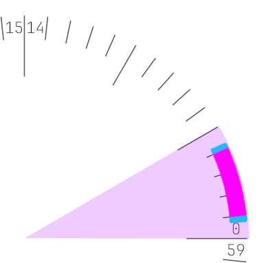
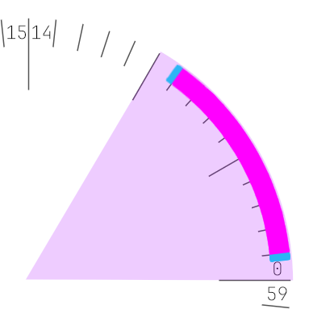
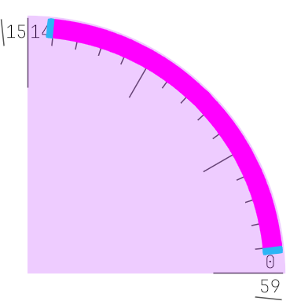
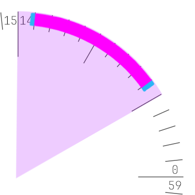

# SAT Format (ver.2)

SATURN ~~An~~notation Table

Developed by yasu3d, with help and feedback from the WA+ community.  
This document is inspired by the [specification for TOML](https://toml.io/en/v1.0.0).

## Objectives

SAT is a custom rhythm game notation format for SATURN.  
It aims to be an expandable and more human-readable format than MER or many other notation formats, opting to represent types and modifiers with words instead of IDs.

## Spec

- SAT is a plaintext file encoded in UTF-8.
- Parsers for SAT are case-sensitive.
- Only one object can be defined per line.
- Valid whitespace characters are: Space ` ` `(0x20)`
- Valid newline characters are: LF `\n` `(0x0A)` or CRLF `\r\n` `(0x0D 0x0A)`
- The amount of whitespace and newlines between blocks of data are arbitrary, but adhering to [design guidelines](#design-guidelines) is recommended for consistency.

## Parser Comments

Parser comments are a way to manually tell the parser to ignore a line.  
These comments **are not parsed** by SATURN or the editor. They are not kept track of, and will not persist after opening and overwriting a chart file in the editor.

A Number Sign `#` `(0x23)` marks a line as a parser comment.

```sat
# This comment will not be parsed.
16   0    0    20   15   TOUCH
```

```sat
# This object is commented out and will not be parsed:
# 16   0    0    20   15   TOUCH
```

Parser comments cannot be on the same line as another object.

```sat
16   0    0    20   15   TOUCH  # This is not a comment and will cause a parse error.
```

## Metadata Tags

Metadata tags build a key-value pair with blocks of data.  
A metadata tag begins with an At Sign `@` `(0x40)`, and its key is written in MACRO_CASE.  
The value of a metadata tag is not case-sensitive and can contain any character supported by UTF-8.  
The value of a metadata tag cannot span multiple lines.  

```sat
@EXAMPLE_TAG    The quick brown fox
                jumped over the lazy dog.

# @EXAMPLE_TAG  = "The quick brown fox"
# The rest will cause a parser error or be ignored.
```

The value of a metadata tag can **not** begin or end with whitespace. Any whitespace before and after the value is trimmed.

```sat
@EXAMPLE_TAG    Example Value    

# @EXAMPLE_TAG  = "Example Value"
# @EXAMPLE_TAG != "    Example Value    "
```

Defining the same metadata tag multiple times is valid, but may lead to undefined results.  
Current parsers scan line-by-line, so the last defined metadata tag will overwrite previous ones.

```sat
@EXAMPLE_TAG    One
@EXAMPLE_TAG    Two

# @EXAMPLE_TAG = Two
```

Metadata tags **must** come before collection tags.  
Metadata tags **can** be defined out of order, but this is not recommended.  
Metadata tags **can** be omitted, but this is not recommended.  

```sat
# THIS IS INVALID.

@OBJECTS
# ...

@TITLE          Sample Song
# ...
```

SATURN has a fixed set of metadata tags with different kinds of value types:

<table>
	<tbody>
		<tr>
			<th>Tag</th>
			<th>Value Type</th>
			<th colspan="2">Purpose</th>
		</tr>
		<tr>
			<td><code>@SAT_VERSION</code></td>
			<td>Integer</td>
			<td colspan="2">The format version the file was saved in.</td>
		</tr>
		<tr>
			<td><code>@VERSION</code></td>
			<td>String</td>
			<td colspan="2">A user-defined version string for a chart. Entirely optional and only used to keep track of chart revisions.</td>
		</tr>
		<tr>
			<td><code>@GUID</code></td>
			<td>String</td>
			<td colspan="2">A randomly generated <b>G</b>lobally <b>U</b>nique <b>Id</b>entifier (GUID) to identify each chart.</td>
		</tr>
		<tr>
			<td><code>@TITLE</code></td>
			<td>String</td>
			<td colspan="2">Title of the charted song.</td>
		</tr>
		<tr>
			<td><code>@RUBI</code></td>
			<td>String</td>
			<td colspan="2">Title of the charted song, written in the latin alphabet and hiragana only.</td>
		</tr>
		<tr>
			<td><code>@ARTIST</code></td>
			<td>String</td>
			<td colspan="2">Artist of the charted song.</td>
		</tr>
		<tr>
			<td><code>@AUTHOR</code></td>
			<td>String</td>
			<td colspan="2">Author / Note Designer of the chart.</td>
		</tr>
		<tr>
			<td><code>@BPM_TEXT</code></td>
			<td>String</td>
			<td colspan="2">BPM to display during song select. Does not affect chart BPM.</td>
		</tr>
		<tr>
			<td rowspan="10" style="vertical-align: top"><code>@BACKGROUND</code></td>
			<td rowspan="10" style="vertical-align: top">Index</td>
            <td colspan="2">Background to display during gameplay.</td>
		</tr>
        <tr>
            <th>Id</th>
			<th>Background</th>
        </tr>
		<tr>
			<td>0</td>
			<td>Auto (Version 3 / Boss / World's End, depending on the defined difficulty.)</td>
		</tr>
		<tr>
			<td>1</td>
			<td>Saturn</td>
		</tr>
		<tr>
			<td>2</td>
			<td>Version 3</td>
		</tr>
		<tr>
			<td>3</td>
			<td>Version 2</td>
		</tr>
		<tr>
			<td>4</td>
			<td>Version 1</td>
		</tr>
		<tr>
			<td>5</td>
			<td>Boss</td>
		</tr>
		<tr>
			<td>6</td>
			<td>Stage Up</td>
		</tr>
        <tr>
			<td>7</td>
			<td>Jacket</td>
		</tr>
		<tr>
			<td rowspan="7" style="vertical-align: top"><code>@DIFF</code></td>
			<td rowspan="7" style="vertical-align: top">Index</td>
            <td colspan="2">Difficulty of the chart.</td>
		</tr>
        <tr>
            <th>Id</th>
			<th>Difficulty</th>
        </tr>
		<tr>
			<td>0</td>
			<td>Normal</td>
		</tr>
		<tr>
			<td>1</td>
			<td>Hard</td>
		</tr>
		<tr>
			<td>2</td>
			<td>Expert</td>
		</tr>
		<tr>
			<td>3</td>
			<td>Inferno</td>
		</tr>
		<tr>
			<td>4</td>
			<td>World's End</td>
		</tr>
		<tr>
			<td><code>@LEVEL</code></td>
			<td>Decimal</td>
			<td colspan="2">Level / Constant of the chart.</td>
		</tr>
		<tr>
			<td><code>@CLEAR</code></td>
			<td>Decimal</td>
			<td colspan="2">Clear threshold of the chart.</td>
		</tr>
		<tr>
			<td><code>@PREVIEW_START</code></td>
			<td>Seconds</td>
			<td colspan="2">Start time for the song and chart preview.</td>
		</tr>
		<tr>
			<td><code>@PREVIEW_TIME</code></td>
			<td>Seconds</td>
			<td colspan="2">Duration of the song and chart preview.</td>
		</tr>
		<tr>
			<td><code>@BGM</code></td>
			<td>Filepath</td>
			<td colspan="2">Local path to audio file.</td>
		</tr>
		<tr>
			<td><code>@BGM_OFFSET</code></td>
			<td>Seconds</td>
			<td colspan="2">Audio offset in seconds.<br/>Positive offset makes the audio earlier than the chart.<br/>Negative offset makes the audio later than the chart.</td>
		</tr>
		<tr>
			<td><code>@BGA</code></td>
			<td>Filepath</td>
			<td colspan="2">Local path to video file.</td>
		</tr>
		<tr>
			<td><code>@BGA_OFFSET</code></td>
			<td>Seconds</td>
			<td colspan="2">Video offset in seconds.<br/>Positive offset makes the video earlier than the chart.<br/>Negative offset makes the video later than the chart.</td>
		</tr>
        <tr>
			<td><code>@JACKET</code></td>
			<td>Filepath</td>
			<td colspan="2">Local path to jacket file.</td>
		</tr>
	</tbody>
</table>

## Collection Tags

Collection Tags declare a collection of elements.  
Like metadata tags, a collection tag begins with an At Sign `@` `(0x40)`, and its key is written in MACRO_CASE.  
The value of a collection tag is not a single line of data, but a list of chart elements with their own format guidelines.  
Collection tags and the elements they contain are each separated by a newline.  

```sat
@OBJECTS
1    0    0    30   15   TOUCH
2    0    1    30   15   TOUCH
3    0    2    45   15   TOUCH
4    0    3    45   15   TOUCH
# ...
```

Once a collection is defined, all subsequent elements are included in it until the next collection is defined.
    
```sat
# @GIMMICKS begin here.
@GIMMICKS
0    0    0    BPM               120.000000
0    0    1    TIMESIG             4      4
1    0    2    HISPEED             0.500000
2    0    3    HISPEED             1.000000

# @GIMMICKS end here and @OBJECTS begin.
@OBJECTS
1    0    0    30   15   TOUCH
2    0    1    30   15   TOUCH
3    0    2    45   15   TOUCH
```

There are three collection tags in a chart file: `@COMMENTS`, `@GIMMICKS`, `@OBJECTS`.  
Collection tags **must** be defined in the correct order shown here.  
Collection tags **cannot** be omitted, even if they are empty.

```sat
@COMMENTS
# Empty

@GIMMICKS
# Empty

@OBJECTS
# Empty
```

## Timestamps

Timestamps are the first thing defined for any object.  
A timestamp in SAT is made up of two integers: measure and tick.  
They take up the first and second column.

```sat
# Measure 1, Tick 0
1    0    ...
   
# Measure 2, Tick 480
2    480  ...
   
# Measure 3, Tick 960
3    960  ...
```

### Measure

A measure corresponds to a bar / measure in standard music notation. It serves as the most basic time division.  

### Tick

Each measure is subdivided into 1920 ticks. They allow for more precise placement of notes and evenly divide into common rhythmic subdivisions in music.  
Ticks are not beats. They function directly as a positional reference within a measure.

Ticks have a maximum value of 1919, as the timestamp would roll over to the next measure on the 1920th tick.

### Effects of BPM and Time Signature

The duration of a measure in seconds is determined by the beats per minute (BPM) and the time signature.
- BPM scales the duration of a measure.
- Time signature acts as a multiplier in the same way BPM does, and does not change the number of beats in a measure.
- The number of ticks per measure is always fixed at 1920, regardless of BPM or time signature changes.

Since BPM and time signature scale measures in the same way, different combinations can result in the same note placements.  
- 200BPM 4/4
- 400BPM 8/4 (twice as fast, but measures are twice as long)
- 100BPM 2/4 (half as fast, but measures are half as long)

To calculate the duration of a measure in seconds, you can use this formula:  
`(60 * 4) / (BPM / (Time Signature Upper / Time Signature Lower))`

## Indices

Indices are the second thing defined for any object.  
An index in SAT is a single integer.

Indices begin at 0 for each new collection, and count up one for every object.  
They take up the third column.

```sat
@GIMMICKS
0    0    0    ...
0    0    1    ...
1    0    2    ...
2    0    3    ...

# Index
@OBJECTS
1    0    0    ...
2    0    1    ...
3    0    2    ...
```

## Comments

Unlike [parser comments](#parser-comments), these comments are actually read by the parser and persist between saves and loads.  
Their purpose is also quite different. Comments are editor-only annotations with timestamps, akin to bookmarks in Beat Saber maps.

Comments define a message after the index. Messages can contain any character supported by UTF-8.  
They take up the fourth column.

```sat
@COMMENTS
1    0    0    Hello World!
```

## Gimmicks

Gimmicks are global gameplay effects. They don't have a specific shape, just a time at which they occur.  
Gimmicks define a type after the index. Types are written in MACRO_CASE.  
They take up the fourth column.

```sat
@GIMMICKS
100  0    0    CHART_END
```

Some types of gimmicks define one or two more values after their type.

```sat
@GIMMICKS
# BPM changes define the new bpm after the type.
0    0    0    BPM               120.000000

# Time signature changes define the new upper and lower after the type.
0    0    1    TIMESIG             4      4
```

### Types

#### BPM

Defined by: `BPM`.  
Changes the current BPM.

BPM changes define one decimal: their new BPM. This decimal **must be greater than 0.**  
BPM changes do not change scroll speed.

```sat
@GIMMICKS
0    0    0    BPM               120.000000
```

#### Time Signature

Defined by: `TIMESIG`.  
Changes the current time signature.

Time signature changes define two integers: their new upper and lower. These integers **must be greater than 0.**  
Time signature changes do not change scroll speed.

```sat
@GIMMICKS
0    0    0    TIMESIG             4      4
```

#### Hi-Speed

Defined by: `HISPEED`.  
Changes the current Hi-Speed. Also known as Scroll Speed or Soflan.

Hi-Speed changes define one decimal: their new scroll speed. This decimal can be any value, positive or negative.

```sat
@GIMMICKS
0    0    0    HISPEED             0.500000
```

#### Stop

Defined by: `STOP_START`, `STOP_END`.  
Sets scroll speed to 0 on `STOP_START`, and sets it back to what it was before on `STOP_END`.

Stops require both gimmicks to function.  
Defining them out of order or not defining all of them may lead to undefined behaviour or a parsing error.

Stops define no other values.

```sat
@GIMMICKS
1    0    0    STOP_START
2    0    1    STOP_END
```

#### Reverse

Defined by: `REV_START`, `REV_END`, `REV_ZONE_END`.  
From `REV_START` until `REV_END`, a set of notes scrolls backwards.
This set of notes is captured by the area between `REV_END` and `REV_ZONE_END`.

Reverses require all three gimmicks to function.  
Defining them out of order or not defining all of them may lead to undefined behaviour or a parsing error.

Reverses define no other values.

```sat
@GIMMICKS
1    0    0    REV_START
2    0    1    REV_END
3    0    2    REV_ZONE_END
```

#### Chart End

Defined by: `CHART_END`.  
Marks the end of the chart and stops playback.  
There **can** be more than one `CHART_END` in a chart, but this is not recommended as it may lead to undefined behaviour.  
Current parsers scan line-by-line, so the last defined `CHART_END` will overwrite previous ones.

Chart Ends define no other values.

```sat
@GIMMICKS
1    0    0    CHART_END
```

### Attributes

Attributes are "modifiers" that get hooked onto types to change their behaviour.  
Attributes begin with a Period `.` `0x2e` and are written in MACRO_CASE.

#### Scroll Layer

Defined by: `.L0`, `.L1`, `.L2`, `.L3`, `.L4`, `.L5`, `.L6`, `.L7`, `.L8`, `.L9`.  
Applicable to: `HISPEED`, `STOP_START`, `STOP_END`.

Changes the scroll layer the gimmick affects.  
All gimmicks are implicitly assigned to Layer `.L0` by default. This attribute can therefore be omitted unless the gimmick should be assigned to another layer.

```sat
@GIMMICKS
# Sets Hi-Speed on Layer .L1
0    0    0    HISPEED.L1          0.500000
1    0    1    HISPEED.L1         1.000000

# Implicitly assigned to Layer .L0
3    0    2    STOP_START
4    0    3    STOP_END

# Explicitly assigned to Layer .L0
5    0    4    HISPEED.L0             0.500000
```

If `STOP_START` is assigned to a scroll layer, `STOP_END` will automatically be assigned to the same one.

```sat
@GIMMICKS
3    0    0    STOP_START.L1
4    0    1    STOP_END
# Implicitly assigned to Layer .L1 during parsing.
```

This happens even if `STOP_END` was explicitly assigned to a different layer.

```sat
@GIMMICKS
3    0    0    STOP_START.L4
4    0    1    STOP_END.L1
# Implicitly assigned to Layer .L4 during parsing.
```

It's recommended to explicitly assign both `STOP_START` and `STOP_END` to the same layer for clarity.

## Objects

Objects are visual effects and gameplay notes with a set shape.  
Objects define two integers after the index: position and size.  
They take up the fourth and fifth column.

```sat
@OBJECTS
# Position 30, Size 15
1    0    0    30   15   ...

# Position 45, Size 20
2    0    1    45   20   ...
```

After position and size, objects define their type. Types are written in MACRO_CASE.

```sat
@OBJECTS
1    0    0    30   15   TOUCH
2    0    1    45   15   SLIDE_CW
```

### Position and Size

SATURN uses polar coordinates.  
The position of an object determines its start angle, and the size of an object determines its sweep angle.

#### Position

There are 60 available positions around the circle, each in 6° increments. These are called "units".

Position 0 begins at 3 o'clock / east on the circle. From there positions proceed **counterclockwise**.  
Position 15 is at 12 o'clock / north,  
Position 30 is at 9 o'clock / west,  
Position 45 is at 6 o'clock / south.

Positions greater or equal to 60 do not exist. Above position 59, it loops around to 0.  
Positions less than 0 also do not exist. Below position 0, it loops around to 59.


#### Size

There are 59 available sizes, each also in 6° increments.  
An object begins at its defined position, and sweeps counterclockwise by `size` units.

```sat
@OBJECTS
# Position 0, Size 5
1    0    0    0    5    ...
```



```sat
@OBJECTS
# Position 0, Size 10
1    0    0    0    10   ...
```



```sat
@OBJECTS
# Position 0, Size 15
1    0    0    0    15   ...
```



```sat
@OBJECTS
# Position 5, Size 10
1    0    0    5    10   ...
```



### Types

#### Touch

Defined by: `TOUCH`.  
A basic note. Requires a touch anywhere within the note at the right time to be judged.

```sat
@OBJECTS
1    0    0    45   15   TOUCH
```

#### Chain

Defined by: `CHAIN`.  
A "basic" / "hold" note. Requires any held down input anywhere within the note to be judged.

```sat
@OBJECTS
1    0    0    45   15   CHAIN
```

#### Hold

Defined by: `HOLD_START`, `HOLD_POINT`, `HOLD_END`.  
A "hold" note. Requires being held down anywhere within the note for its entire length to be judged.  
It does not require letting go at the end.

Defining a hold requires multiple objects.  
A `HOLD_START` object creates a new hold, a `HOLD_END` object ends it.

```sat
@OBJECTS
1    0    0    45   15   HOLD_START
2    0    1    45   15   HOLD_END
```

All objects between `HOLD_START` and `HOLD_END` will be part of the hold and control its shape. They all **must** be `HOLD_POINT` objects. 

```sat
# This is NOT a valid hold. TOUCH was defined in the middle of a hold.

@OBJECTS
1    0    0    45   15   HOLD_START
1    480  1    46   15   HOLD_POINT
1    960  2    47   15   TOUCH
1    1440 3    48   15   HOLD_POINT
2    0    4    49   15   HOLD_END
```

```sat
# This is a valid hold.

@OBJECTS
1    0    0    45   15   HOLD_START
1    480  1    46   15   HOLD_POINT
1    960  2    47   15   HOLD_POINT
1    1440 3    48   15   HOLD_POINT
2    0    4    49   15   HOLD_END
```

Similarly, multiple holds cannot be defined at the same time. One must end before the next can begin.

```sat
# This is NOT a valid hold.

@OBJECTS
1    0    0    45   15   HOLD_START
1    480  1    46   15   HOLD_POINT
1    960  2    30   15   HOLD_START
1    1440 3    47   15   HOLD_POINT
2    0    4    48   15   HOLD_END
2    480  5    30   15   HOLD_END
```

Instead, objects may be defined out of order (in time) to define holds.

```sat
# Example from above, defined correctly:

@OBJECTS
1    0    0    45   15   HOLD_START
1    480  1    46   15   HOLD_POINT
1    1440 2    47   15   HOLD_POINT
2    0    3    48   15   HOLD_END

# Timestamp goes "back in time" to define second hold.
1    960  4    30   15   HOLD_START
2    480  5    30   15   HOLD_END
```

```sat
# A hold with a touch note halfway in:

@OBJECTS
1    0    0    45   15   HOLD_START
2    0    1    45   15   HOLD_END
1    960  2    30   15   TOUCH
```

#### Slide Clockwise

Defined by: `SLIDE_CW`.  
A "flick" note. Requires a clockwise sliding motion anywhere within the note at the right time to be judged.

```sat
@OBJECTS
1    0    0    45   15   SLIDE_CW
```

#### Slide Counterclockwise

Defined by: `SLIDE_CCW`.  
A "flick" note. Requires a counterclockwise sliding motion anywhere within the note at the right time to be judged.

```sat
@OBJECTS
1    0    0    45   15   SLIDE_CCW
```

#### Snap Forward

Defined by: `SNAP_FW`.  
A "flick" note. Requires a forward sliding motion anywhere within the note at the right time to be judged.

```sat
@OBJECTS
1    0    0    45   15   SNAP_FW
```

#### Snap Backward

Defined by: `SNAP_BW`.  
A "flick" note. Requires a backward sliding motion anywhere within the note at the right time to be judged.

```sat
@OBJECTS
1    0    0    45   15   SNAP_BW
```

#### Damage

Defined by: `DAMAGE`.  
A "damage" / "dodge" note. Touching it will result in a miss.

```sat
@OBJECTS
1    0    0    45   15   DAMAGE
```

#### Mask Add

Defined by: `MASK_ADD`.  
A visual effect. Enables the lane notes travel along with a sweep animation along its length. Does not affect gameplay.  
Must be defined with the [mask direction](#mask-direction) attribute.

```sat
@OBJECTS
1    0    0    45   15   MASK_ADD.CW
```

#### Mask Subtract

Defined by: `MASK_SUB`.  
A visual effect. Disables the lane notes travel along with a sweep animation along its length. Does not affect gameplay.  
Must be defined with the [mask direction](#mask-direction) attribute.

```sat
@OBJECTS
1    0    0    45   15   MASK_SUB.CW
```

#### Trace

Defined by: `TRACE_START`, `TRACE_POINT`, `TRACE_END`.  
A visual effect. A thin line / ribbon for decoration. Does not affect gameplay.

Traces have the same definition rules as holds. One must end before the next can be defined, and no other object types may be defined in the middle of one. Additionally, traces can only be size 2.  
Must be defined with the [trace color](#trace-color) attribute.

```sat
@OBJECTS
1    0    0    45   15   TRACE_START.WHITE
2    0    1    45   15   TRACE_END
```

### Attributes

#### Scroll Layer

Defined by: `.L0`, `.L1`, `.L2`, `.L3`, `.L4`, `.L5`, `.L6`, `.L7`, `.L8`, `.L9`.  
Applicable to: `TOUCH`, `CHAIN`, `HOLD_START`, `HOLD_POINT`, `HOLD_END`, `SLIDE_CW`, `SLIDE_CCW`, `SNAP_FW`, `SNAP_BW`, `DAMAGE`, `TRACE_START`, `TRACE_POINT`, `TRACE_END`.  
*(everything except `MASK_ADD` and `MASK_SUB`)*

Changes the scroll layer the object belongs to.  
All objects are implicitly assigned to Layer `.L0` by default. This attribute can therefore be omitted unless the object should be assigned to another layer.

```sat
@OBJECTS
1    0    0    45   15   TOUCH.L1
2    0    1    45   15   TOUCH.L1

# Implicitly assigned to Layer .L0
3    0    2    45   15   TOUCH
3    0    3    30   15   TOUCH

# Explicitly assigned to Layer .L0
4    0    4    45   15   TOUCH.L0
```

If `HOLD_START` is assigned to a scroll layer, all `HOLD_POINT` and `HOLD_END` objects part of the hold will automatically be assigned to the same one.

```sat
@OBJECTS
1    0    0    45   15   HOLD_START.L1
1    480  1    46   15   HOLD_POINT
1    1440 2    47   15   HOLD_POINT
2    0    3    48   15   HOLD_END
# Implicitly assigned to Layer .L1 during parsing.
```

This happens even if `HOLD_POINT` and `HOLD_END` objects are explicitly assigned to a different layer.

```sat
@OBJECTS
1    0    0    45   15   HOLD_START.L4
1    480  1    46   15   HOLD_POINT.L1
1    1440 2    47   15   HOLD_POINT.L0
2    0    3    48   15   HOLD_END.L3
# All objects implicitly assigned to Layer .L4 during parsing.
```

It's not necessary to explicitly assign all `HOLD_POINT` and `HOLD_END` objects to a layer.  
Only assigning `HOLD_START` reduces clutter.  

#### Bonus

#### R-Note

#### No Render

#### Mask Direction

#### Trace Color

## Design Guidelines

```sat
# Created with SampleEditor v1.0.0
@SAT_VERSION    2

@VERSION        
@GUID           XX00000000-0000-0000-0000-000000000000
@TITLE          Title
@RUBI           TITLE
@ARTIST         Artist
@AUTHOR         Note Designer
@BPM_TEXT       120

@BACKGROUND     0

@DIFF           2
@LEVEL          10.000000
@CLEAR          0.830000

@PREVIEW_START  0.00
@PREVIEW_TIME   10.00

@BGM            audio.wav
@BGM_OFFSET     0.000000
@BGA            video.mp4
@BGA_OFFSET     0.000000
@JACKET         jacket.png
```
